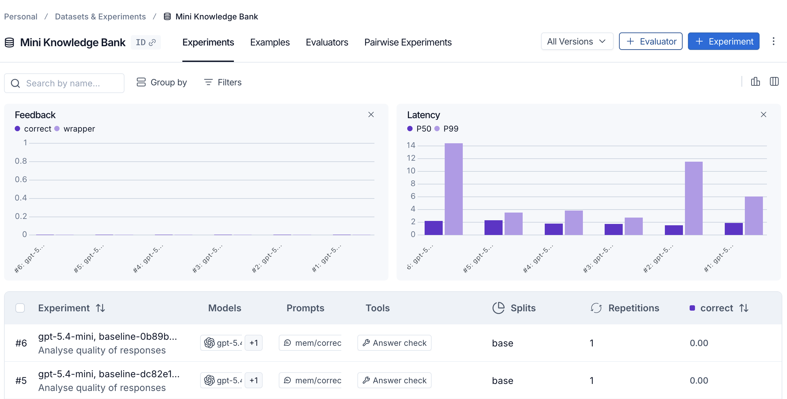

# Knowledge Bank
Knowledge Bank is proof-of-concept AI-Native application. This uses [LangSmith](www.langchain.com) to evaluate non-deterministic LLM responses.

## Evaluation
### What's being evaluated?
We're carrying out evaluation from two viewpoints: strict evaluation; and judgmental evaluation. These are both deliberately naïve for demonstration purposes. And the first one judges correctness by exact matching. This is done to demonstrate why rigidity will always be an unfriendly judgement model. We don't look at using an LLM as a judge. This is purposefully naive. Naive in the sense that the same LLM that gave the response is the same LLM that will be used to provide judgement. We could have, as an alternative, permitted a different model, a higher-powered model, to serve as judge over the lesser model.

## Installation
```sh
pip install -r requirements.txt
```

## Running
Ensure that you've enabled this [setting](https://code.visualstudio.com/docs/python/environments) in order for your environmental variables to be picked up. Alternatively, you can use [py-dotenv](https://pypi.org/project/python-dotenv/) for an editor-agnostic setup.

## Testing
### Running Tests
```sh
python -m pytest tests/
```

## Experiment
### Dashboard
This is a dashboard providing information about the results of the experiment for judged evaluation. This screenshot demonstrates what the Experiment Dashboard looks like.


## Research
### References
- This project doesn't use [OpenAI Evals](https://developers.openai.com/api/docs/guides/evals). This has been added here for inspiration on the general approach for evaluation.

## Next Steps
This is highly experimental. Next steps are yet to be determined.